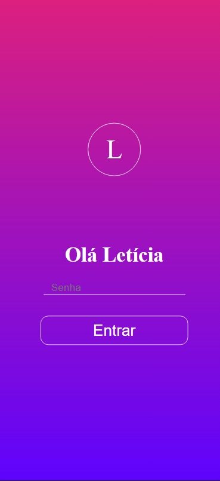
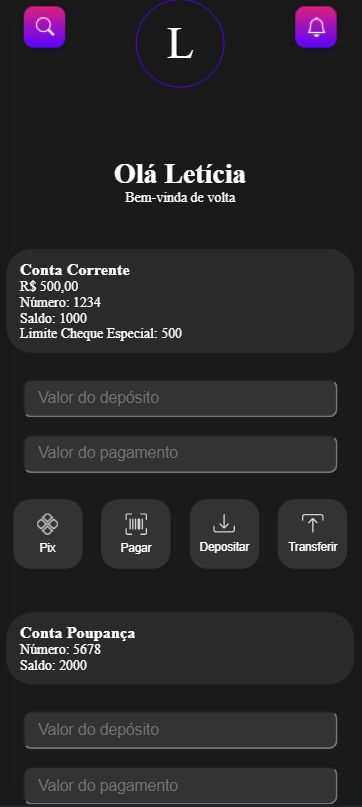

# Projeto Banco Digital

🚧 PROJETO EM CONSTRUÇÃO

## 📄 Descrição do Projeto

Projeto desenvolvido com o objetivo de treinar programação orientada a objetos, utilizando herança, polimorfismo e encapsulamento. 
Foi feito um exemplo de aplicativo mobile que realiza depósito e saque nas contas correntes e poupança como forma de demonstrar como se deve usar o constructor e suas ramificações.

## 📷 Imagens do projeto

## 📋 Tecnologias utilizadas
<ul>
<li>HTML/CSS</li>
<li>Javascript</li>
<ul>
  
## 📦 Como inicializar:
  
1. Utilize a extensão Live Server do VS Code para uma melhor visualização do projeto.
  

  

Desenvolvido por Letícia Dayane

## 📖 Referências utilizadas:

https://www.figma.com/file/rh8CMYVy27QEkvgkRT9bt7/APP-Banco-Digital-(Community)?node-id=11%3A125&mode=dev

https://www.figma.com/file/3iGMq7Ih3XM06YXP7G1w37/BANCO-DIGITAL---Portifólio---Home%2C-Cartão-virtual-(Community)?type=design&node-id=1-4&mode=design&t=mBx1OvKP43AC7H3m-0
